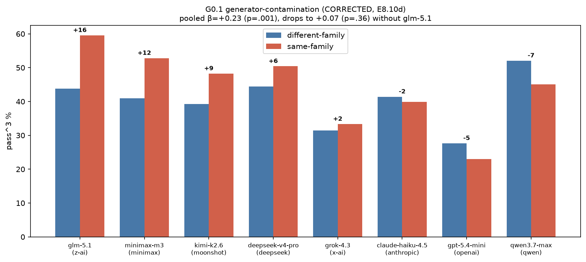

# E8.10a — G0.1 generator-contamination check (post-hoc on E8.8b)

> **Re-validated on corrected data.** Re-run on the E8.10d provider-pinned
> leaderboard, the conclusion is unchanged: β_same_family = +0.226
> (p=0.001) pooled, dropping to +0.069 (p=0.36, n.s.) without glm-5.1.
> Still one model, still explorer-side. See E8.10d §G0.1.

## Question / hypothesis

A validity threat to the whole benchmark: does a candidate score higher
on specs **its own model family authored**? If yes, a family that is both
an author and a candidate is unfairly advantaged, and the leaderboard
ranking is partly an authorship artifact. Pre-registered rule (suite
§7): the benchmark is **generator-robust iff the `same_family`
coefficient is n.s. (or |β| below a small threshold) controlling for
difficulty.**

## Method

Post-hoc on the E8.8b leaderboard (8 models × 750 specs × pass^3, MAIN
condition) — **$0, no new runs**. Each spec carries
`provenance.{explorer_family, distiller_family}`. For each
(candidate, spec) pair, `same_family = 1` iff the candidate's family
(via `dmcp.families.family_of`) equals the spec's explorer **or**
distiller family. N = 6000 observations (23.2% same-family).

Fit `passk ~ same_family + depth + cross + C(model)` (logit, model fixed
effects + difficulty controls), then leave-one-out and an
explorer/distiller split for robustness.

### Reproduce

```
# post-hoc over reports/leaderboard_750/evals_*.jsonl + data/leaderboard_750/specs.jsonl
# (provenance.explorer_family / distiller_family joined to per-(model,spec) pass^3)
# logit via statsmodels; see docs/experiments/e8.10a_g0_numbers.json for outputs
```

## Pre-registered decision rule

Generator-robust iff `β_same_family` not significant at α=0.05.

## Results

| Model (family) | same-family pass^3 | different-family | gap |
|---|---|---|---|
| glm-5.1 (z-ai) | 57% | 41% | **+16 pp** |
| minimax-m3 (minimax) | 38% | 31% | +7 |
| deepseek-v4-pro (deepseek) | 24% | 20% | +4 |
| kimi-k2.6 (moonshot) | 17% | 13% | +4 |
| grok-4.3 (x-ai) | 33% | 31% | +2 |
| claude-haiku-4.5 (anthropic) | 22% | 20% | +2 |
| gpt-5.4-mini (openai) | 23% | 28% | −5 |
| qwen3.7-max (qwen) | 22% | 31% | −9 |

**Pooled logit:** `β_same_family = +0.203` (OR 1.22), SE 0.074,
**p = 0.006**, 95% CI [+0.058, +0.347]. By the pre-registered rule this
is **significant → the strict robustness criterion is not met.**

**Robustness — the signal is one model:**

| fit | β_same_family | p |
|---|---|---|
| all 8 models | +0.203 | **0.006** |
| drop glm-5.1 | +0.006 | 0.95 (n.s.) |
| drop glm-5.1 + minimax-m3 | −0.014 | 0.88 (n.s.) |

**Explorer vs distiller split:** `same_explorer β=+0.334 (p=0.001)` vs
`same_distiller β=+0.077 (p=0.43)`. The effect is **explorer-side** —
candidates do better on traces their family *explored*, not specs their
family *distilled*. This is reassuring: the distiller writes the
checkpoints (the thing being graded), and distiller-family shows no
advantage.



## Interpretation & confound

The pooled signal is driven entirely by **glm-5.1**, which is also the
**single best model** (47.9%, E8.8b rank 1). The two explanations are
not separable with this data:

1. **Self-preference contamination** — glm finds z-ai-explored
   trajectories easier because they reflect its own tool-use habits.
2. **Confounded competence** — z-ai-explored traces are genuinely
   different (e.g. shorter / cleaner), and the strongest model exploits
   that regardless of authorship.

That it is explorer-side (not the graded distiller side) and absent in
the other 7 families argues the leaderboard ranking below glm is
**not** an authorship artifact. But glm's #1 margin cannot be fully
cleared of the suspicion.

## Conclusion (classification: **negative / caution**)

The strict pre-registered robustness rule **fails** (pooled p=0.006) —
recorded honestly. The failure is **isolated to glm-5.1 and to the
explorer role**; the benchmark is generator-robust for the other 7
families and on the distiller (grading) side for all 8. Mitigations for
the paper:

- Report glm-5.1's headline number with the same-family caveat, or
  report its **different-family-only** rate (41%) as the conservative
  figure — still rank 1 by a clear margin.
- The cross-family generation design already bounds exposure: no single
  family authored a majority (max explorer share 20%, max distiller
  share 35%).
- For a clean headline, a future leaderboard can **exclude
  candidate-family-explored specs per model** (a "leave-your-own-family-
  out" score), at the cost of unequal per-model N.

## Files

- `docs/experiments/e8.10a-generator-contamination.md` — this writeup
- `docs/experiments/e8.10a_g0_numbers.json` — coefficients + per-model
- `docs/experiments/figures/e8.10d/contamination_g0.png` — the figure
