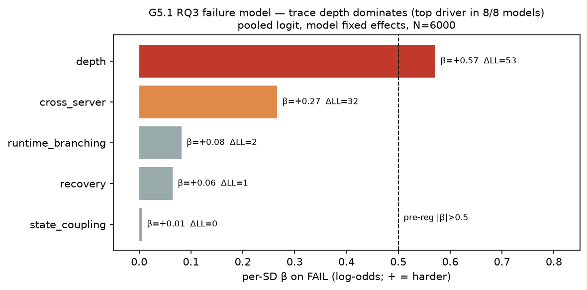

# E8.10b — G5.1 RQ3 failure model (post-hoc on E8.8b)

> **Re-validated on corrected data (E8.10d).** RQ3's conclusion holds:
> `depth` is the top driver in 8/8 models (drop-loglik 62). Nuance: on the
> corrected leaderboard depth's standardised β is 0.490 — fractionally
> below the pre-registered 0.5 line (was 0.571), while `cross_server`
> strengthened (drop-loglik 31.7→51.0). Best read as depth + cross-server
> co-dominating. See E8.10d §G5.1.

## Question / hypothesis

RQ3: **which structural properties of a task predict that a candidate
agent fails it?** A credible benchmark should fail agents for principled
structural reasons (depth, cross-server orchestration, recovery), not
noise. Pre-registered rule (suite §7): RQ3 is **positive iff ≥1
trace-property has |β| > 0.5 in the pooled fit AND its drop-loglik loss
> 0.5 AND it is the top driver in ≥2/3 of per-model fits.**

## Method

Post-hoc on the E8.8b leaderboard (8 models × 750 specs × pass^3) —
**$0**. Outcome = `fail` (¬pass^3). Predictors from each spec's
`complexity` block: `depth` (trace_depth), `cross_server`,
`runtime_branching`, `state_coupling`, `recovery_required`. Predictors
standardised to unit SD so β is per-SD log-odds and comparable across
features. Pooled logit with **model fixed effects** (`C(model)`);
drop-loglik importance = LL(full) − LL(feature removed); plus a separate
per-model fit. N = 6000.

**Two collinearities handled:** `distinct_servers` is dropped (it is
`cross_server` by construction); `state_coupling` and
`dynamism=stateful_write` are **perfectly correlated in this corpus**
(every stateful_write spec is state-coupled) so only `state_coupling` is
kept — its coefficient stands in for both.

### Reproduce

```
# post-hoc over reports/leaderboard_750/evals_*.jsonl + data/leaderboard_750/specs.jsonl
# fail ~ depth + cross_server + runtime_branching + state_coupling + recovery + C(model)
# standardized predictors; statsmodels logit; drop-loglik per feature; per-model refit
# outputs -> docs/experiments/e8.10b_g5_numbers.json
```

## Pre-registered decision rule

Positive iff ∃ feature with |β|>0.5 (per-SD) AND drop-loglik>0.5 AND top
driver in ≥6/8 models.

## Results

Overall fail rate (pass^3) = **72.3%**.

### Pooled logit (per-SD β on FAIL; + = harder; model fixed effects)

| feature | β/SD | OR/SD | p | drop-loglik |
|---|---|---|---|---|
| **depth** | **+0.571** | **1.77** | 2e-18 | **52.9** |
| cross_server | +0.266 | 1.31 | 7e-15 | 31.7 |
| runtime_branching | +0.082 | 1.08 | 0.027 | 2.5 |
| recovery | +0.064 | 1.07 | 0.091 | 1.5 |
| state_coupling | +0.005 | 1.01 | 0.88 | 0.0 |

### Per-model top driver

`depth` is the **#1 |β| feature in all 8/8 models** (β ranging +0.34
glm-5.1 … +1.61 kimi-k2.6). cross_server is the consistent #2.



### Pre-registered verdict — **POSITIVE**

`depth` satisfies all three conditions: |β|=0.571 > 0.5 ✓, drop-loglik
52.9 ≫ 0.5 ✓, top driver in 8/8 ≥ 6/8 ✓.

### Findings

1. **Trace depth is the dominant, universal failure driver.** One SD of
   depth (~3 steps) raises the fail odds 1.77× and is the single
   strongest predictor for every model — agents degrade with the length
   of the required tool chain, exactly as a trace-grounded benchmark
   should bite.
2. **Cross-server is the strong, robust second axis** (OR 1.31/SD,
   p=7e-15) — orchestration across services is independently hard after
   controlling for depth. This is the SAE/multi-server signal echoing
   the E8.8b stratified profile.
3. **runtime_branching is weak-but-real; recovery and state_coupling are
   not independent drivers** once depth + cross_server are in the model.
   Their difficulty (visible marginally in E8.8b) is largely *mediated*
   by the depth and cross-server structure they co-occur with, rather
   than adding failure risk of their own.
4. **The effect is structural, not model-idiosyncratic** — the 8/8
   per-model agreement on depth means the benchmark's difficulty is a
   property of the *tasks*, supporting RQ3's claim that DynamicMCPBench
   discriminates on principled grounds.

## Conclusion (classification: **positive**)

RQ3 confirmed under its pre-registered rule: task failure is driven by
trace depth (universally, 8/8 models) and cross-server scope
(robustly), not by noise. Caveat for the writeup: `state_coupling` and
`dynamism` are the same variable in the current corpus, so their joint
effect is reported as one coefficient (null here, after depth/scope) —
future corpora should decouple them to test stateful difficulty
separately.

## Files

- `docs/experiments/e8.10b-failure-model.md` — this writeup
- `docs/experiments/e8.10b_g5_numbers.json` — coefficients + per-model
- `docs/experiments/figures/e8.8b/failure_model_g5.png` — the figure
