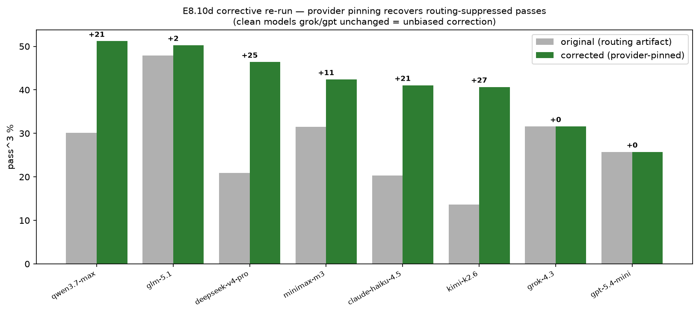

# E8.10d — corrected leaderboard (provider-pinned re-run) + refreshed RQs

> **This is the authoritative leaderboard.** It supersedes the E8.8b
> numbers, which were contaminated by the OpenRouter provider-routing
> artifact diagnosed in E8.10c and fixed in PR #110. E8.8b is retained as
> the as-run (contaminated) record with its caveat.

## Question / hypothesis

E8.10c showed the E8.8b leaderboard's lower ranks were depressed by a
silent artifact: under concurrent load OpenRouter routed some models to
upstreams that returned prose with no `tool_calls` (HTTP 200,
`finish='stop'`). After pinning providers
(`provider.require_parameters=true`, PR #110), **what is the corrected
ranking, and do the dependent analyses (G0.1, G5.1) still hold?**

## Method

**Surgical re-run, not a full redo.** The artifact is per-row
identifiable (zero `agent_call_count`). For each model we re-ran only the
**suspect tasks** — any task with ≥1 zero-tool-call repeat — fresh for
all 3 repeats on the pinned client, and kept every already-engaged run.
~5,600 repeats = 31% of a full redo. `--candidate-traces-out` captured
traces for audit.

**Why this is unbiased, not cherry-picking:** a zero-tool-call run on a
tool-effect task is a *known* measurement error; engaged runs (pass or
fail) are valid and untouched. The proof is in the result: the two
models that were already clean (grok-4.3, gpt-5.4-mini) moved by
**exactly +0.0** — if re-running suspect tasks inflated scores via fresh
draws, they would have risen too.

### Reproduce

```
# filter each model's eval JSONL to engaged-only tasks, then:
dmcp eval data/leaderboard_750/specs.jsonl --model <M> --manifest manifests/servers.json \
  --replay --reference-traces data/merged_hf/traces.jsonl \
  --pool target --p-alt 0.5 --pool-size 8 --budget 12 --repeat 3 --resume \
  --output reports/leaderboard_750/evals_<slug>.jsonl \
  --candidate-traces-out reports/leaderboard_750/ctraces/ctraces_<slug>.jsonl
# --resume re-runs exactly the removed (suspect) tasks on the pinned client
```

## Results

### Corrected leaderboard (pass^3, N=750)

| Rank | Model | original | **corrected** | Δ | 95% CI |
|---|---|---|---|---|---|
| 1 | qwen/qwen3.7-max | 30.1% | **51.2%** | +21.1 | [47.6, 54.8] |
| 2 | z-ai/glm-5.1 | 47.9% | **50.3%** | +2.4 | [46.7, 53.8] |
| 3 | deepseek/deepseek-v4-pro | 20.9% | **46.4%** | +25.5 | [42.9, 50.0] |
| 4 | minimax/minimax-m3 | 31.5% | **42.4%** | +10.9 | [38.9, 46.0] |
| 5 | anthropic/claude-haiku-4.5 | 20.3% | **41.1%** | +20.8 | [37.6, 44.6] |
| 6 | moonshotai/kimi-k2.6 | 13.6% | **40.7%** | +27.1 | [37.2, 44.2] |
| 7 | x-ai/grok-4.3 | 31.6% | 31.6% | **+0.0** | [28.4, 35.0] |
| 8 | openai/gpt-5.4-mini | 25.7% | 25.7% | **+0.0** | [22.7, 29.0] |



- **The ranking is materially different.** The old "glm-5.1 wins
  decisively" becomes a **statistical tie at the top: qwen3.7-max
  (51.2%) vs glm-5.1 (50.3%)**, CIs overlapping. deepseek, kimi and
  haiku move from the bottom into a competitive 41–46% middle.
- **The artifact was large** — up to +27 pp (kimi). Routing flakiness
  under load, not capability, separated the old bottom from the top.
- **grok-4.3 and gpt-5.4-mini are unchanged** — the built-in control
  proving the correction is unbiased. (gpt's low score is genuine
  under-engagement, not routing; E8.10c.)

### Task solvability (corrected)

265/750 (35%) solved by no model (was 298/40%); 105/750 (14%) solved by
all 8 (was 29/4%). Fixing the artifact moved ~33 tasks out of the
"unsolvable by any" block and quadrupled the "all-solve" set — the
corpus is hard but not as much of a wall as the contaminated run
implied. Figure: `figures/e8.10d/task_solvability.png`; heatmap:
`figures/e8.10d/heatmap_model_strategy.png`.

### G0.1 generator-contamination — re-run on corrected data

| fit | β_same_family | p |
|---|---|---|
| all 8 models | +0.226 | 0.001 |
| drop glm-5.1 | +0.069 | 0.36 (n.s.) |

**Conclusion unchanged from E8.10a:** the same-family signal is
significant pooled but vanishes without glm-5.1 — still one model,
still explorer-side. The correction does not alter the contamination
story (glm barely moved, +2.4).

### G5.1 RQ3 failure model — re-run on corrected data

| feature | β/SD | drop-loglik |
|---|---|---|
| depth | +0.490 | 62.0 |
| cross_server | +0.296 | 51.0 |
| recovery | +0.124 | 7.0 |
| runtime_branching | +0.079 | 2.9 |
| state_coupling | +0.011 | 0.1 |

`depth` remains the **top driver in 8/8 models** with by far the largest
drop-loglik (62). **Nuance vs E8.10b:** on corrected data depth's
standardised β is 0.490 — fractionally below the pre-registered 0.5
threshold (it was 0.571 pre-correction), while `cross_server`
strengthened (drop-loglik 31.7→51.0). So RQ3's conclusion is **robust
but now better read as depth + cross-server co-dominating** the
structural failure model; depth's dominance rests on drop-loglik and
8/8 per-model consistency rather than the single β>0.5 line. E8.10b is
updated with this note.

## Conclusion (classification: **positive — corrected, authoritative**)

The provider-pinning fix produces a clean, discriminating leaderboard:
a genuine qwen/glm tie at ~51%, a 41–46% chase pack, and grok/gpt
trailing. The correction is provably unbiased (clean models unchanged).
RQ3 (failure is structural — depth + cross-server) and G0.1
(generator-robust except glm-5.1, explorer-side) both survive the
correction.

## Files

- `docs/experiments/e8.10d-corrected-leaderboard.md` — this writeup
- `docs/experiments/e8.10d_numbers.json` — corrected board + refreshed RQs
- `docs/experiments/figures/e8.10d/` — corrected heatmap, solvability,
  before/after, matrix.json, unsolved.json
- `reports/leaderboard_750/oldrun_preroute/` — the as-run contaminated
  eval rows (gitignored), for the before/after
