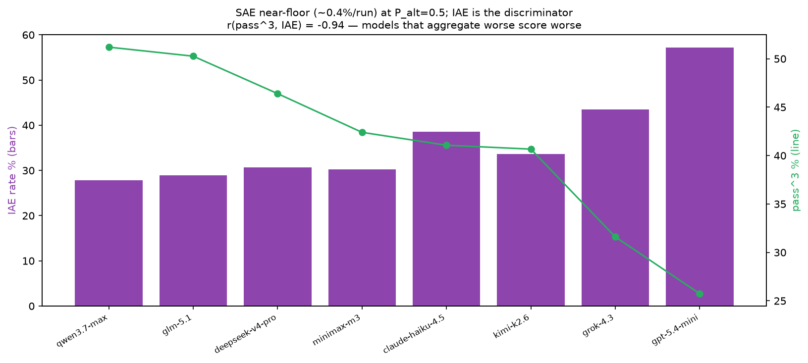

# E8.10e — SAE / IAE behavioural profile (post-hoc on corrected leaderboard)

## Question / hypothesis

The benchmark's signature metrics are **SAE** (spurious-alternative
engagement — calling a wrong-server look-alike tool) and **IAE**
(incomplete-aggregation error — finishing a multi-step task without
aggregating the required pieces). Both are captured per run in
`EvaluationResult.summary`. **What is the SAE/IAE profile of the 8
models under the MAIN condition, and does either predict the
leaderboard?** Post-hoc on the E8.10d corrected runs — **$0**.

## Method

Aggregate `summary.sae` and `summary.iae` across all 2250 rows/model on
the corrected (provider-pinned) leaderboard. SAE per-run %, IAE rate =
`iae.total / iae.opportunities`. Correlate IAE rate with pass^3.

## Results

| model | pass^3 | IAE rate | SAE / run |
|---|---|---|---|
| qwen3.7-max | 51.2% | 27.8% | 0.98% |
| glm-5.1 | 50.3% | 28.9% | 1.42% |
| deepseek-v4-pro | 46.4% | 30.7% | 1.56% |
| minimax-m3 | 42.4% | 30.2% | 1.11% |
| claude-haiku-4.5 | 41.1% | 38.6% | 0.80% |
| kimi-k2.6 | 40.7% | 33.7% | 1.20% |
| grok-4.3 | 31.6% | 43.5% | 0.27% |
| gpt-5.4-mini | 25.7% | 57.2% | 0.04% |

### Findings

1. **IAE is the dominant behavioural failure signal — `r(pass^3, IAE) =
   −0.944`.** Models that more often stop a multi-step task without
   aggregating the pieces score lower, almost monotonically. gpt-5.4-mini
   (57% IAE) and grok-4.3 (44%) are the worst aggregators and the bottom
   two of the board; qwen/glm (28–29%) the best and the top two.
2. **SAE is near-floor (~0.4–1.6% of runs) at P_alt=0.5**, and **100% of
   the SAE that fires is `expected` type (same-family), zero `random`.**
   Under the MAIN condition the models are essentially not fooled into
   calling wrong-server look-alike tools — the namesake metric barely
   engages at this alternative-injection rate.
3. **SAE tracks engagement, not capability**: the lowest-SAE models are
   the *under-engagers* (gpt 0.04%, grok 0.27%) — they make few tool
   calls, so few chances to mis-call; the heavy engagers (deepseek 1.56%,
   glm 1.42%) show the most SAE. So a low SAE rate here is not a virtue.

## Conclusion (classification: **positive — and it scopes E8.9**)

The corrected leaderboard is explained behaviourally by **aggregation
quality (IAE), not alternative-tool confusion (SAE)**. At P_alt=0.5 SAE
is near-floor, which is precisely the motivation for the **E8.9 P_alt
sweep (G3.1)**: the open question is whether cranking the alternative-
injection rate up induces SAE, or whether these models are robust to
spurious alternatives across the board. IAE, by contrast, is already a
strong, ready discriminator (r=−0.94) and a candidate headline axis
alongside pass^3.

## Files

- `docs/experiments/e8.10e-sae-iae-profile.md` — this writeup
- `docs/experiments/e8.10e_sae_iae_numbers.json` — per-model SAE/IAE
- `docs/experiments/figures/e8.10d/sae_iae_profile.png` — the figure
