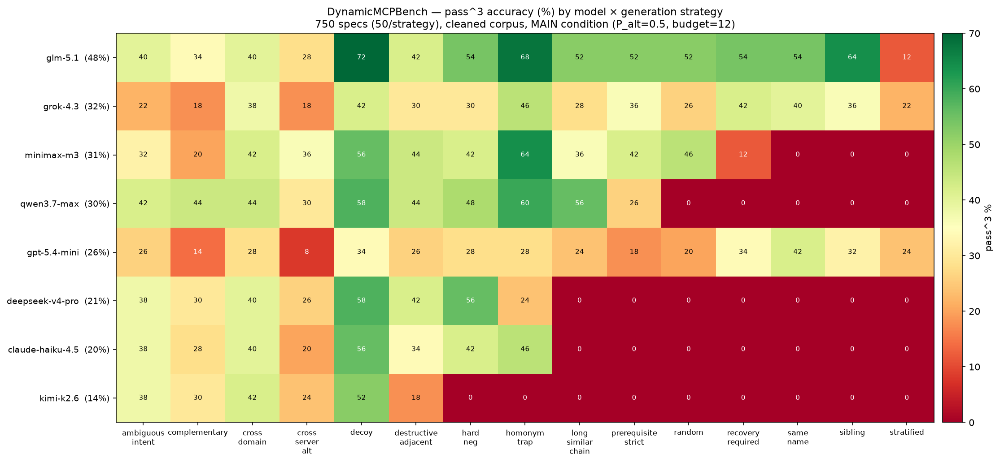

# E8.8b — 8-model leaderboard on the cleaned corpus (750-spec, pass^3)

> **⚠️ SUPERSEDED — numbers below are contaminated.** The provider-routing
> artifact (E8.10c) depressed the lower ranks; the **authoritative
> corrected leaderboard is [E8.10d](e8.10d-corrected-leaderboard.md)**
> (qwen 51.2% / glm 50.3% tied at top after a provider-pinned re-run).
> This report is retained as the as-run record only.

## Question / hypothesis

The headline leaderboard: how do the 8 candidate models rank on
effect-checkpoint pass^3 over a balanced slice of the cleaned shared
corpus, under the MAIN condition? Supersedes the E8.8 free-endpoint
leaderboard (dead endpoint, 0%-twin artifacts) and an aborted first
attempt on the pre-cleaning corpus + old evaluator (see §Provenance).

## Method

- **Corpus:** the cleaned HF dataset (`TokenWasteGroup/DynamicMCPBench`,
  1717 self-consistent specs after Ilya's #102/#104 filters). A
  **deterministic 50-per-strategy slice = 750 specs** (sorted by
  `task_id`, first 50 of each of the 15 strategies). Strata tracked the
  full corpus within ≤2 pp on depth / dynamism / scope.
- **Condition (MAIN):** `dmcp eval --replay --reference-traces`,
  `--pool target --p-alt 0.5 --pool-size 8 --budget 12 --repeat 3`.
  pass^3 = all three repeats pass.
- **Models (8):** glm-5.1, grok-4.3, minimax-m3, qwen3.7-max,
  gpt-5.4-mini, deepseek-v4-pro, claude-haiku-4.5, kimi-k2.6.
- **Execution:** 8 parallel lanes, one OpenRouter key each
  (`--key-offset`-free disjoint env keys), `--resume` per lane.
  ~6 h wall, ~$160 direct.
- **Code:** evaluator at `38aa4d3` (post #100–#105 scoring fixes).

### Reproduce

```
# subset already in data/leaderboard_750/specs.jsonl (50/strategy, deterministic)
for M in deepseek/deepseek-v4-pro z-ai/glm-5.1 moonshotai/kimi-k2.6 \
         minimax/minimax-m3 qwen/qwen3.7-max x-ai/grok-4.3 \
         openai/gpt-5.4-mini anthropic/claude-haiku-4.5; do
  dmcp eval data/leaderboard_750/specs.jsonl --model $M \
    --manifest manifests/servers.json --replay \
    --reference-traces data/merged_hf/traces.jsonl \
    --pool target --p-alt 0.5 --pool-size 8 --budget 12 --repeat 3 \
    --resume --output reports/leaderboard_750/evals_<slug>.jsonl
done
python3 -m scripts... # analysis -> reports/leaderboard_750/analysis/{matrix,unsolved}.json + heatmaps
```

## Pre-registered decision rule

Descriptive leaderboard (no pass/fail). Ranking is read off
non-overlapping Wilson 95% CIs; the strategy heatmap and difficulty
curve are the headline figures.

## ⚠️ Validity caveat (added post-hoc — bottom ranks are contaminated)

A follow-up diagnostic (E8.10c) found that the **low-ranked models'
scores are understated by a transient OpenRouter provider-routing
artifact.** Under the 8-lane concurrent load, many requests to the
weaker-engaging models returned content with **no `tool_calls`** (HTTP
200, `finish='stop'`, no error — so the in-client retries did not
fire); the agent then stopped at zero tool calls and failed the task.

Evidence: re-running deepseek-v4-pro on 20 tasks it scored **zero
tool-calls** on, using the **exact eval pool surface + seed**, it
engaged a tool on **17/20 (85%)**. The zero-calls were therefore
~85% transient, not model behaviour and not SAE difficulty.

Tool-engagement correlates with score at **r=0.875**, and the zero-call
rate is concentrated in the bottom ranks (kimi 64%, haiku 53%, deepseek
51% of all runs) vs the top (glm 6%, grok 1%). **The top of the board
(glm-5.1, grok-4.3) is reliable; ranks 4–8 are likely understated and
need a re-run with provider pinning before they can be quoted.** See
E8.10c. The figures and absolute numbers below are retained as the
as-run record but must be read with this caveat.

## Results

### Leaderboard (pass^3, N=750)

| Rank | Model | pass^3 | 95% CI |
|---|---|---|---|
| 1 | **z-ai/glm-5.1** | **47.9%** | [44.3, 51.4] |
| 2 | x-ai/grok-4.3 | 31.6% | [28.4, 35.0] |
| 3 | minimax/minimax-m3 | 31.5% | [28.2, 34.9] |
| 4 | qwen/qwen3.7-max | 30.1% | [27.0, 33.5] |
| 5 | openai/gpt-5.4-mini | 25.7% | [22.7, 29.0] |
| 6 | deepseek/deepseek-v4-pro | 20.9% | [18.2, 24.0] |
| 7 | anthropic/claude-haiku-4.5 | 20.3% | [17.5, 23.3] |
| 8 | moonshotai/kimi-k2.6 | 13.6% | [11.3, 16.2] |

- **glm-5.1 wins decisively** — CI clears the #2 cluster by ~13 pp.
- **#2–#4 (grok / minimax / qwen) are a statistical tie** (CIs overlap).
- The old free-endpoint calibration's "four-way 90% tie" collapses on
  the harder corpus: the benchmark now discriminates.

### Headline figures



- `figures/e8.8b/heatmap_model_strategy.png` — 8×15 pass^3 by model ×
  strategy (per-cell N=50). Green columns: `random`, `stratified`,
  `sibling`. Red across all models: `long_similar_chain`,
  `cross_server_alt`, `recovery_required`, `prerequisite_strict` — the
  SAE-stress strategies bite as designed.
- `figures/e8.8b/task_solvability.png` — per-task green/red, sorted by #
  models solving (the unsolved-cluster figure).
- `figures/e8.8b/heatmap_difficulty.png`,
  `figures/e8.8b/heatmap_scope.png` — stratified companions.

### The unsolved cluster (per-task analysis)

- **298/750 (39.7%) solved by no model; 29/750 (3.9%) solved by all 8.**
- **All 298 unsolved tasks are gold-consistent** (verified with
  `gold_unsatisfied_tool_effects`): their reference trace satisfies its
  own checkpoints, so they are **genuinely hard, not broken** — real
  headroom, not a residual "wall".
- The unsolved set spans all 15 strategies fairly evenly (`stratified`
  33, `cross_server_alt` 28, `complementary` 26 … `homonym_trap` 10),
  i.e. broad difficulty rather than one pathological generation path.

### Stratified profile (post-hoc, same runs — G2.4)

Monotone difficulty gradient holds for **every** model:

| axis | easy → hard pattern (top vs bottom model) |
|---|---|
| depth | glm 58→51→28%, kimi 21→10→4% — strictly descending |
| scope | universal intra→inter drop (glm 55→33, gpt-5.4-mini 33→10) |
| dynamism | live_read > stateful_write for 7/8 models |

Cross-server is the universal wall — the SAE/orchestration signal the
benchmark targets, visible in every model's intra/inter gap.

### Scoring-fix before/after (lanes that finished under both code versions)

| Model | old evaluator | fixed evaluator | Δ |
|---|---|---|---|
| grok-4.3 | 32.0% | 31.6% | −0.4 |
| gpt-5.4-mini | 24.5% | 25.7% | +1.2 |
| claude-haiku-4.5 | 40.0%¹ | 20.3% | −19.7 |

¹ old haiku lane was on the *pre-cleaning* corpus (n=710, included
unpassable specs) — not directly comparable; the drop conflates the
corpus cleaning with the scoring fix. grok/gpt (text-wrapping models)
barely moved, consistent with #101: the phantom-fail bias hit
tool-heavy models, which is why the corrected ranking reshuffles the
mid-pack vs the old free-pool numbers.

## Conclusion (classification: **positive**)

A clean, discriminating headline leaderboard: glm-5.1 leads at 47.9%
pass^3, a tight 30–32% chase pack, and an 8th-place floor at 13.6%.
40% of tasks defeat every model yet are all solvable in principle —
the benchmark has substantial, honest headroom and the SAE-stress
strategies + cross-server scope are the dominant difficulty drivers.

## Provenance / what was discarded

The first launch (pre-cleaning 1527 corpus + pre-#100 evaluator) was
killed after 2 lanes: the old evaluator failed list/dict arg predicates
unconditionally and phantom-failed budget-exhausted agents
model-dependently (#100/#101/#103), and the corpus still held
self-inconsistent specs (#102/#104). Those runs are archived under
`reports/leaderboard_750_oldcode/` for the before/after only; no old
rows enter this result.

## Files

- `docs/experiments/e8.8b-leaderboard-cleaned-750.md` — this writeup
- `docs/experiments/e8.8b_numbers.json` — machine-readable leaderboard
- `docs/experiments/figures/e8.8b/` — 4 PNGs + `matrix.json` + `unsolved.json`
- `reports/leaderboard_750/evals_*.jsonl` — raw eval rows (gitignored, regenerable)
