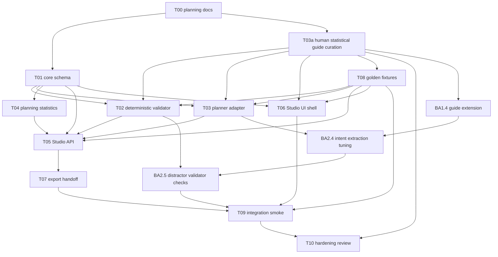

# Benchmark Advisor Task Graph

This file keeps the dependency graph for PR-sized task packets. The
claim-ledger view that mirrors `docs/PLAN.md` lives at
`docs_benchmark_advisor/PLAN.md`.

## Mermaid Dependency Graph

## Parallelizable Tasks

- After T00: T01 and human-led T03a can run in parallel.
- After T03a: T08 can start because fixtures must cite stable, curated guide
  rule ids.
- After T01/T03a/T08: T02, T03, and T06 can run in parallel.
- After T01: T04 can run.
- After T02/T03/T04/T08: T05 can run.
- After T05: T07 can run.
- T09 and T10 are sequential integration/hardening tasks.
- Follow-up advisor quality work runs as: BA1.4 guide extension -> BA2.4
  planner intent extraction -> BA2.5 validator distractor checks -> BA4 smoke.

## Blocking Tasks

- T00 blocks all implementation because interfaces must be frozen first.
- T01 blocks implementation tasks that consume schemas.
- T03a blocks planner knowledge grounding, rationale requirements, and
  guide-reference tests. It is a human research/curation step, with agents only
  assisting on formatting and consistency checks.
- T05 blocks live API integration and export handoff.
- BA1.4 blocks planner/validator follow-ups for domain, short-workflow, and
  distractor-pressure intent.
- T09 blocks hardening review.

## Recommended PR Order

1. T00 planning docs.
2. T01 core schema and T03a human statistical guide curation.
3. T08 golden fixtures.
4. T02 validator, T03 planner, T04 stats, T06 UI shell.
5. T05 Studio API and T07 export handoff.
6. BA1.4, BA2.4, BA2.5 follow-up quality fixes.
7. T09 integration smoke.
8. T10 hardening review.

## Integration Checkpoints

- **Checkpoint A**: `INTERFACES.md` accepted and frozen.
- **Checkpoint B**: `STATISTICAL_GUIDE.md` rule ids are stable and cited by
  fixtures.
- **Checkpoint C**: validator accepts/refuses fixture designs deterministically.
- **Checkpoint D**: API returns fixture-compatible responses.
- **Checkpoint E**: UI renders approved/warning/refused fixture states.
- **Checkpoint F**: UI can show hover rationale from evidence ledger entries.
- **Checkpoint G**: intent-to-export smoke passes without launching generation.
- **Checkpoint H**: legacy advisor route, if retained, cannot be the only v1 API
  route under test.

## Shared/Frozen Files

- `docs_benchmark_advisor/planning/INTERFACES.md`
- `docs_benchmark_advisor/planning/STATISTICAL_GUIDE.md`
- advisor schema module
- golden fixture format
- `docs_benchmark_advisor/fixtures/`
- Studio advisor API route contract
- export config schema

## Likely Merge-Conflict Hotspots

- Studio frontend entry files.
- Studio backend route registration.
- Advisor schema models.
- Golden fixtures if multiple contributors add fixtures in the same file.
- `docs_benchmark_advisor/planning/INTERFACES.md` after freeze.
- `docs_benchmark_advisor/planning/STATISTICAL_GUIDE.md` rule ids after freeze.

## Human Approval Required

- Schema-breaking changes after T00/T01.
- Statistical guide rule-id changes after T03a.
- Adding CLI scope to v1.
- Launching generation/evaluation from Advisor UI.
- Making Stage-2 validation report required for v1.
- Changing benchmark scoring behavior.
- Adding final-answer grading.
- Treating public logs as proof of private deployment behavior.
- Moving advisor logic into core pipeline internals.
- Removing or bypassing the v1 `/api/advisor/design` and
  `/api/advisor/validate` route contract.
